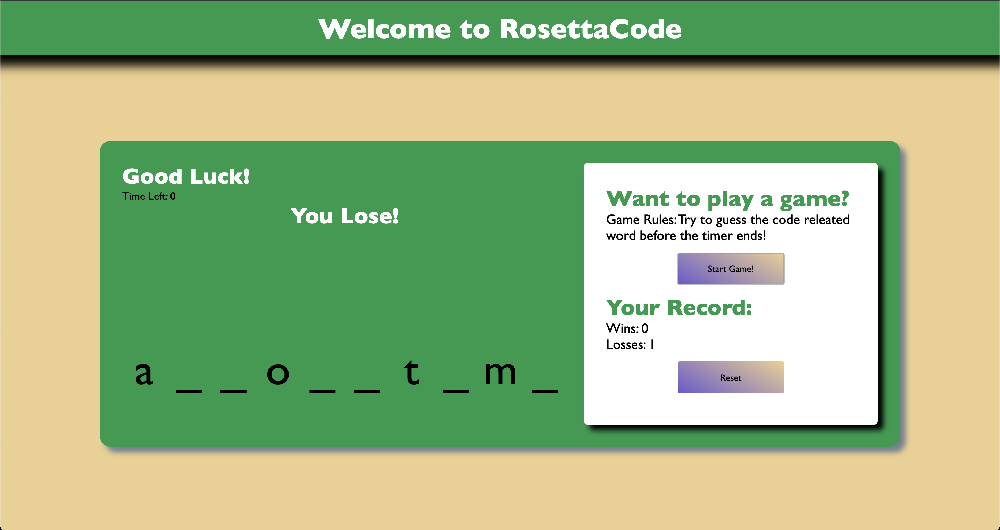

### Deployed Live Version
- https://bdejene19.github.io/WordFillGame/

# Word Fill Trivia

## Live Version example: 
- A User losing the game, trying to solve the word "algorithms". Also updates record

## About 
Application is built using no framework, using only HTML, CSS and JavaScript. The purpose of the Word Fill Trivia is to get acclimated with code related terminology. Using the Web API setInterval, a timer is set for the user when they hit play game. After registering and validating user key events, blanks will be filled in they match characters within a randomly generated word.

The game prints a message to the UI dynamically, depending if the player was successfull or not. Application also makes use of the localStorage API, saving the users record into the web browser.
